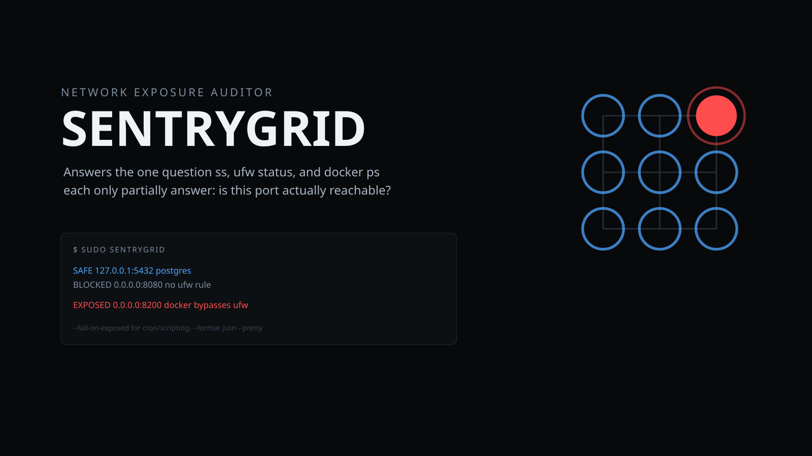

<p align="center"></p>

# 🛰️ SentryGrid

[](https://github.com/darkstardevx/sentrygrid/actions/workflows/ci.yml)
[](https://github.com/darkstardevx/sentrygrid/actions/workflows/release.yml)

`Rust` · `ufw` · `nftables`-adjacent · `docker`

**[darkstardevx.github.io/sentrygrid](https://darkstardevx.github.io/sentrygrid/)**

**Network exposure auditor.** Answers the one question `ss`, `ufw status`,
and `docker ps` each only partially answer on their own: **is this port
actually reachable, and by what mechanism?**

## 📦 Install

```bash
curl -fsSL https://raw.githubusercontent.com/darkstardevx/sentrygrid/main/install.sh | sh
```

Downloads the latest release for Linux (x86_64 or aarch64), verifies its
SHA-256 checksum, and installs `sentrygrid` to `~/.local/bin`. Linux only
— SentryGrid shells out to `ss` and `ufw`, both Linux-specific, so there's
no macOS build. Or build from source with `cargo build --release`.

Built directly out of a real incident this session: a Docker container
(`vault`, running with a hardcoded dev root token) was reachable on the
whole LAN despite `ufw` doing nothing to stop it — Docker inserts its own
`iptables` rules ahead of `ufw`'s, so `ufw`'s status was never the whole
picture. SentryGrid correlates all three sources so that gotcha shows up
automatically instead of needing to be rediscovered by hand.

## 🚀 What it does

For every listening socket:

- **`SAFE`** — bound to loopback only, not reachable from anywhere else
- **`BLOCKED`** — bound wide (`0.0.0.0`/`[::]`/a specific interface address), but `ufw`'s default-deny has no matching rule, so it's currently unreachable
- **`EXPOSED (ufw-allowed)`** — bound wide, `ufw` has an unrestricted `ALLOW IN` rule — reachable from anywhere, presumably on purpose
- **`EXPOSED (ufw-scoped)`** — bound wide, `ufw` has a matching rule, but it's scoped to a specific destination address and/or source — reachable, but only from that scope, not "open to the world"
- **`EXPOSED (docker bypasses ufw)`** — bound wide AND Docker-managed — reachable regardless of what `ufw` says

The `ufw-allowed` vs. `ufw-scoped` distinction exists because an earlier
version of this tool got it wrong: it treated *any* matching `ufw` rule as
"fully open," which produced a real false positive on Docker's own
`172.17.0.1 53/udp ALLOW IN 172.16.0.0/12` DNS rule (scoped to Docker's own
subnet hitting the Docker bridge IP) — reported as if port 53/udp were open
to the entire internet. Found by testing against real live output, not
just synthetic test data; there's a regression test for the exact case.

## ▶️ Running

Needs `sudo` for full process visibility from `ss` (and to read `ufw`'s
rules) — the other two tools are relied on for correctness, so this shells
out to real `ss`, `ufw status verbose`, and `docker ps` rather than
reimplementing socket enumeration or rule parsing from scratch.

```bash
sudo sentrygrid                        # human-readable report
sudo sentrygrid --show-safe            # include loopback-only sockets too
sudo sentrygrid --format json --pretty
sudo sentrygrid --fail-on-exposed      # non-zero exit if anything's EXPOSED — for cron/scripting
```

## 🧩 Layout

```
src/ss.rs      parses `ss -tlnp`/`ss -ulnp` — socket enumeration
src/ufw.rs     parses `ufw status verbose` — tracks destination/source
               scoping per rule, not just "does a rule exist"
src/docker.rs  parses `docker ps` port publications
src/audit.rs   correlates all three into a Finding + Severity per socket
src/format.rs  report/JSON rendering, cybercore-themed colors
```

All parsers are unit-tested against **real captured output** from this
session (`ss`, `ufw status verbose`, `docker ps` samples verbatim), not
synthetic guesses at the format.

## 📄 License

MIT
